# Laporan Praktikum Basis Data - Pertemuan 1

**Nama:** Gilang Pangestu    **NIM:** 25430027    **Kelas:** A    **Tanggal:** 5 Oktober 2026

**Dosen:** Dedi Irawan S.Kom, M.T.I.

## 1. Tujuan Praktikum

Praktikum ini bertujuan agar saya bisa menyiapkan dan mengelola lingkungan kerja basis data menggunakan MariaDB/MySQL melalui XAMPP. Selain itu, saya diharapkan mampu membuat dan mengatur akun pengguna beserta hak aksesnya menggunakan perintah SQL langsung di terminal (CLI), mengonfigurasi phpMyAdmin dengan cara yang aman (mode cookie), serta menggunakan Git dan GitHub untuk menyimpan dan mengelola riwayat pekerjaan praktikum secara online.

## 2. Ringkasan Dasar Teori

Sebuah sistem manajemen basis data (DBMS) seperti MariaDB digunakan untuk menyimpan, menyusun, dan mengolah data dalam jumlah besar secara efisien dan terstruktur. Keamanan dalam DBMS adalah hal yang sangat krusial. Salah satu prinsip utama keamanan basis data adalah manajemen pengguna dan kontrol hak akses (privileges). Dalam MariaDB, akun `root` adalah akun administrator tertinggi yang memiliki akses penuh ke seluruh sistem, sehingga sangat berisiko untuk digunakan dalam operasional sehari-hari.

Oleh karena itu, praktik yang baik adalah membuat akun pengguna baru yang hak aksesnya dibatasi sesuai kebutuhan, misalnya hanya diperbolehkan mengakses satu basis data tertentu, menggunakan perintah `GRANT`. Proses akses pengguna ke server basis data melalui dua tahap: autentikasi (pemeriksaan identitas dan kata sandi) dan otorisasi (pemeriksaan apakah pengguna tersebut diizinkan melakukan suatu tindakan terhadap objek basis data tertentu).

Selain menggunakan terminal (CLI), kita juga dapat mengelola basis data melalui antarmuka web bernama phpMyAdmin. Namun, konfigurasi keamanan phpMyAdmin harus diperhatikan, khususnya metode autentikasi. Sangat disarankan untuk tidak menggunakan mode `config` yang menyimpan kata sandi secara terbuka di berkas konfigurasi, melainkan menggunakan mode `cookie` yang meminta login setiap kali sesi dimulai, demi menjaga keamanan kredensial.

## 3. Hasil Langkah Percobaan

**Persiapan: versi MariaDB dan Git**

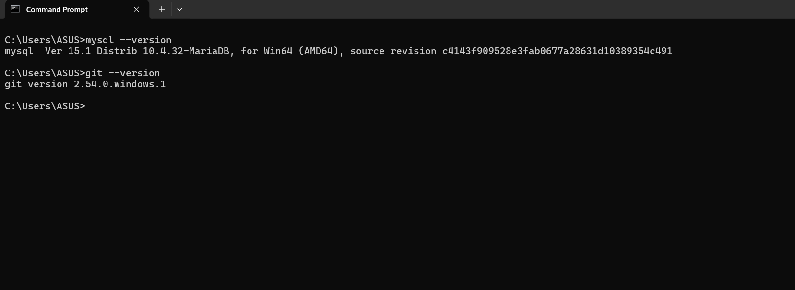

Tangkapan layar di atas menunjukkan proses verifikasi versi MariaDB (`Distrib 10.4.32-MariaDB`) dan versi Git yang terinstal pada sistem melalui terminal.

**D.1 Menjalankan MariaDB di XAMPP**

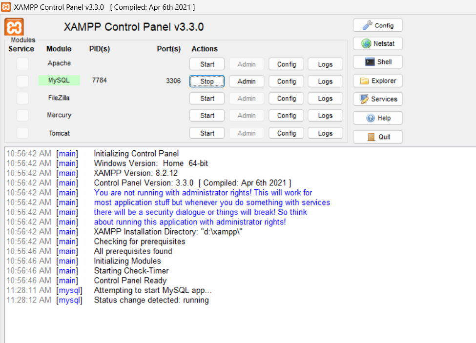

Gambar ini memperlihatkan XAMPP Control Panel dengan layanan MySQL/MariaDB yang statusnya sudah aktif dan berjalan normal menggunakan port standar 3306.

**D.2 Masuk lewat CLI**

![Masuk lewat CLI sebagai root]

Saya masuk ke MariaDB melalui Command Prompt sebagai `root`, lalu menjalankan `SELECT VERSION(), CURRENT_USER();`, `SHOW DATABASES;`, dan `SELECT @@sql_mode;`. Saat pertama kali dikerjakan, akun `root` belum berpassword sehingga perintah masuknya `mysql -u root`, dan hasilnya adalah versi server `10.4.32-MariaDB`, akun `root@localhost`, serta basis data bawaan `information_schema`, `mysql`, `performance_schema`, `phpmyadmin`, dan `test`. Pada pemeriksaan pertama itu `sql_mode` belum memuat `STRICT_TRANS_TABLES`, dan hal ini diperbaiki seperti diuraikan pada Kendala 1. Tangkapan layar di atas diambil ulang setelah password `root` dipasang, sehingga perintah masuknya memakai `-p`, dan hasilnya sudah mencerminkan kondisi terbaru (mode SQL sudah ketat dan basis data praktik sudah ada).

**D.3 Mengamankan akun root**

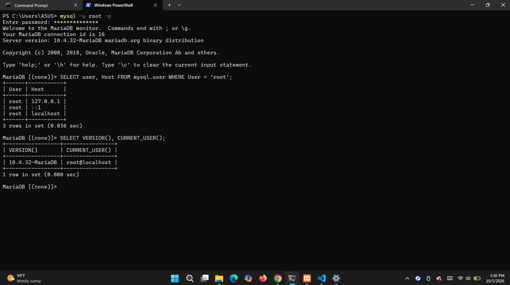

Saya memasang password pada akun `root` menggunakan perintah `ALTER USER` untuk setiap baris `root` yang ada di server (`localhost`, `127.0.0.1`, dan `::1`). Untuk membuktikannya, saya mencoba masuk tanpa opsi `-p` dan server menolak dengan pesan `ERROR 1045 (28000): Access denied for user 'root'@'localhost' (using password: NO)`. Tangkapan layar di atas diambil ulang setelah password terpasang. Analisis galat ini dibahas pada Titik Analisis 2.

**D.4 Akun kerja mhs_027: kueri dan galat 1044**

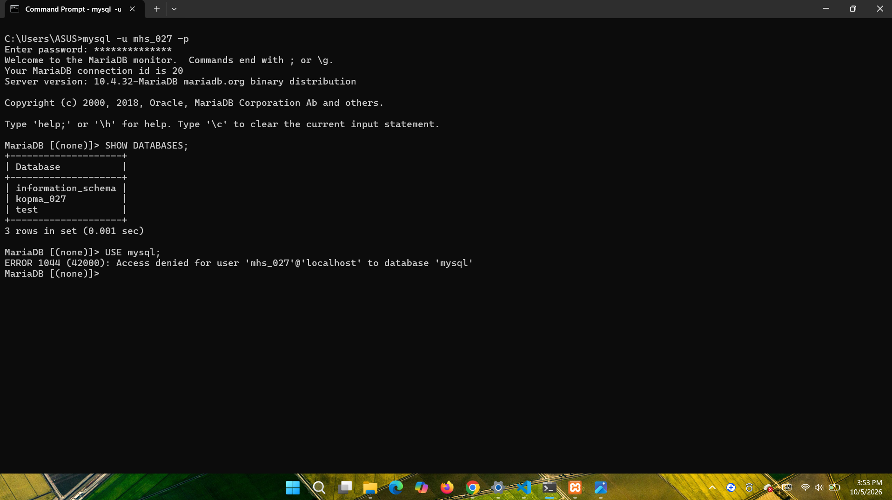

Tangkapan layar terminal saat berhasil login menggunakan akun pengguna `mhs_027`. Gambar ini juga menampilkan daftar basis data yang diizinkan untuk diakses serta pesan penolakan akses ERROR 1044 saat akun tersebut mencoba memilih basis data yang tidak diberi hak akses.

**D.5 phpMyAdmin mode cookie**

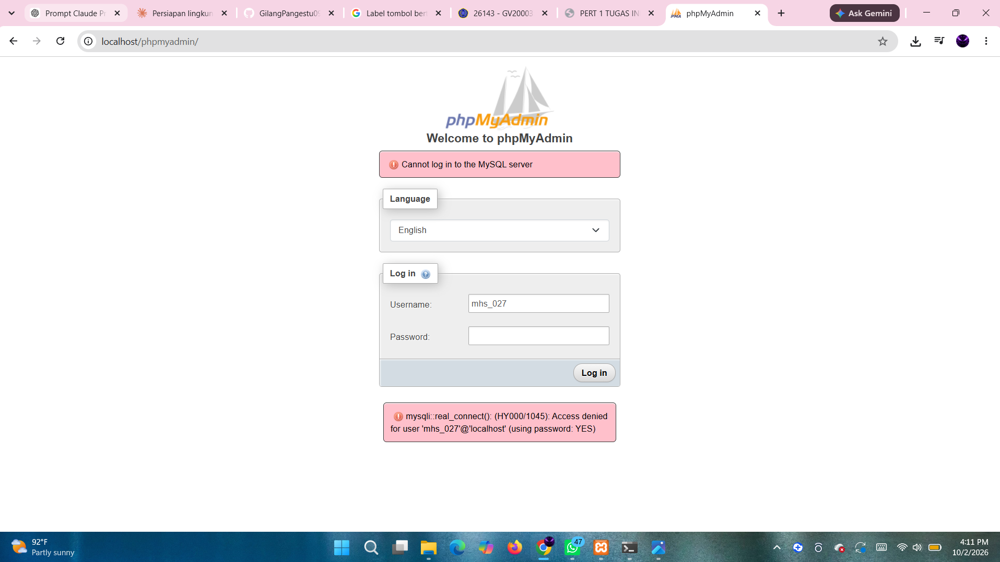

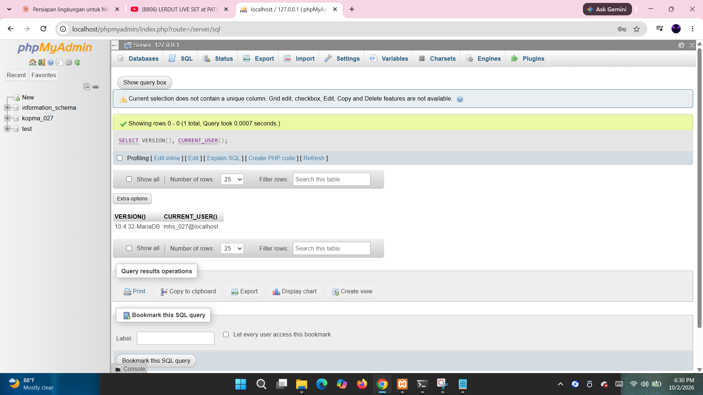

Tampilan halaman login phpMyAdmin dengan konfigurasi mode autentikasi `cookie` yang mewajibkan pengguna memasukkan nama pengguna dan kata sandi, serta contoh eksekusi kueri SQL di dalam dasbor phpMyAdmin setelah berhasil login sebagai pengguna `mhs_027`.

**D.6 Push pertama ke GitHub**

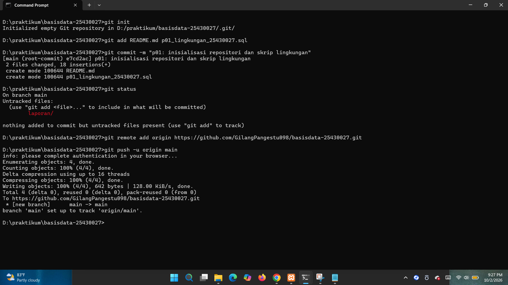

Bukti hasil eksekusi perintah `git push` yang berhasil mengunggah commit pertama dari repositori lokal di komputer saya ke repositori online di GitHub.

## 4. Jawaban Titik Analisis

**Titik Analisis 1**

Hasil praktikum saya membuktikan bahwa ketika saya menjalankan perintah `mysql --version`, terminal menampilkan `Distrib 10.4.32-MariaDB`, yang artinya mesin basis data yang sebenarnya berjalan adalah MariaDB, bukan MySQL asli. Konsekuensi dari hal ini adalah saya tidak bisa sembarangan mengikuti tutorial atau mencari solusi untuk MySQL versi 8.x di internet karena sintaksis dan fitur internalnya bisa berbeda. Dokumentasi MySQL masih bisa saya pakai untuk perintah-perintah SQL standar seperti `SELECT` atau `INSERT`. Namun, untuk hal-hal yang berkaitan dengan manajemen sistem seperti pengaturan pengguna, autentikasi, atau fitur-fitur khusus yang hanya ada di MariaDB, saya wajib merujuk ke dokumentasi MariaDB. Sebelum saya mengikuti tutorial MySQL 8.x, saya harus selalu memeriksa apakah sintaks yang digunakan kompatibel dengan versi MariaDB yang saya pakai.

**Titik Analisis 2**

Pesan galat `ERROR 1045 (28000): Access denied for user 'root'@'localhost' (using password: NO)` memiliki tiga bagian utama: kode galat (1045), nilai SQLSTATE (28000), dan teks keterangan galat. Bagian teks keterangan yang berbunyi `(using password: NO)` secara eksplisit menjawab bahwa server menolak akses karena klien mencoba login tanpa menyertakan kata sandi sama sekali. Ini berbeda dengan galat pada akun `mhs_027` sebelumnya yang berakhiran `(using password: YES)`, yang artinya pengguna tersebut sudah mengirim kata sandi, namun ditolak oleh server karena isinya salah.

**Titik Analisis 3**

`information_schema` masih terlihat oleh `mhs_027` karena isinya hanya metadata sistem yang sifatnya hanya-baca (read-only) dan memang terbuka untuk semua akun yang terdaftar di server. Sebaliknya, basis data `mysql` langsung diblokir dan server menampilkan ERROR 1044 karena di dalam basis data tersebut tersimpan tabel-tabel sistem dan kredensial penting (nama pengguna dan kata sandi) yang tidak boleh diakses oleh pengguna biasa. Akses ke basis data `mysql` ditolak dengan ERROR 1044 karena hak akses yang saya berikan kepada `mhs_027` hanya terbatas pada basis data `kopma_027.*` dan `mysql` tidak termasuk dalam izin tersebut. Secara umum, ERROR 1045 adalah masalah autentikasi yang terjadi pada saat login karena identitas atau kata sandi tidak valid, sedangkan ERROR 1044 adalah masalah otorisasi tingkat basis data yang terjadi setelah pengguna berhasil login, di mana pengguna mencoba mengakses basis data yang tidak diizinkan.

**Titik Analisis 4**

Mode `cookie` lebih aman daripada mode `config` untuk phpMyAdmin. Pada mode `config`, nama pengguna dan kata sandi disimpan secara terbuka (dalam bentuk teks biasa, plain text) di dalam berkas konfigurasi `config.inc.php` di server, dan pengguna langsung masuk ke dashboard tanpa mengetik username dan password. Risiko keamanan ini sangat besar karena jika ada pihak yang bisa membaca berkas tersebut (misalnya, jika server atau berkas konfigurasinya terkompromi), mereka bisa langsung mengetahui kata sandi pengguna basis data. Sementara itu, pada mode `cookie`, kata sandi tidak disimpan di berkas konfigurasi. Sistem akan selalu meminta pengguna untuk login secara manual setiap kali sesi dimulai, dan informasi sesi akan disimpan secara terenkripsi dalam bentuk cookie di peramban pengguna selama sesi tersebut aktif.

**Analisis wajib: perbedaan galat 1044, 1045, dan 1142**

ERROR 1045 terjadi pada tahap autentikasi, di mana server basis data menolak identitas pengguna atau kata sandi yang dikirimkan. Pesan galat ini muncul sebelum pengguna berhasil login ke server.

ERROR 1044 terjadi pada tahap otorisasi tingkat basis data. Pengguna tersebut sudah berhasil login ke server, tetapi ditolak ketika mencoba memilih atau mengakses basis data tertentu karena akunnya tidak memiliki hak akses (privilege) yang diizinkan untuk basis data tersebut.

ERROR 1142 terjadi pada tahap otorisasi tingkat perintah atau objek (tabel/view/kolom). Pengguna sudah berhasil login dan memilih basis data, namun server menolak satu jenis perintah SQL spesifik (seperti `CREATE` atau `INSERT`) pada tabel tertentu karena akun tersebut tidak memiliki hak akses (privilege) khusus untuk melakukan tindakan tersebut pada objek tersebut.

## 5. Hasil Latihan dan Modifikasi

**E.1 Akun tamu_027 dengan hak SELECT saja**

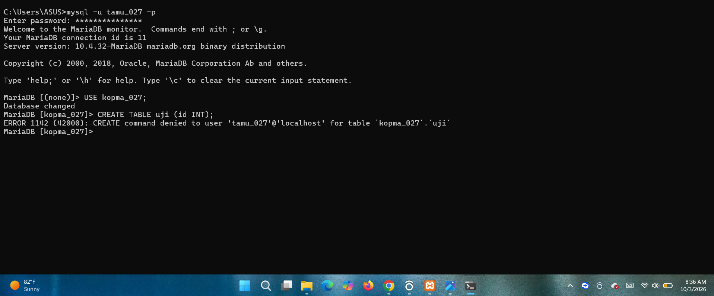

Gambar di atas memperlihatkan contoh penolakan oleh server basis data berupa ERROR 1142 ketika akun `tamu_027`, yang hanya diberi hak `SELECT` saja, mencoba menjalankan perintah DDL untuk membuat tabel baru, yaitu `CREATE TABLE uji (id INT);`.

**E.2 Skrip yang aman dijalankan berulang**

```sql
-- p01_lingkungan_25430027.sql
CREATE DATABASE IF NOT EXISTS kopma_027
  CHARACTER SET utf8mb4 COLLATE utf8mb4_unicode_ci;
CREATE USER IF NOT EXISTS 'mhs_027'@'localhost' IDENTIFIED BY '<password_kerja>';
GRANT ALL PRIVILEGES ON kopma_027.* TO 'mhs_027'@'localhost';
```

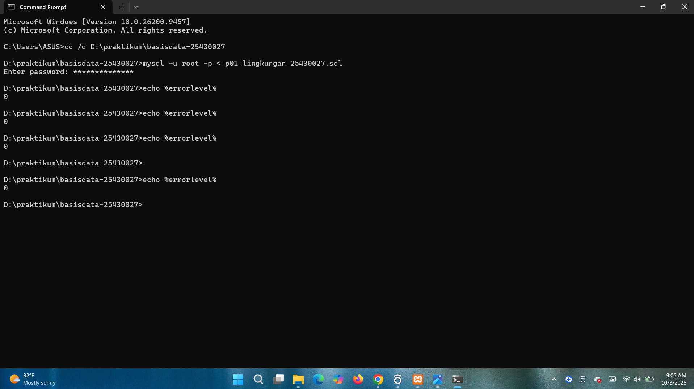

Skrip di atas telah saya modifikasi dengan menambahkan klausul `IF NOT EXISTS` pada perintah `CREATE DATABASE` dan `CREATE USER`. Gambar di atas menunjukkan bahwa skrip tersebut kini aman untuk dijalankan berulang kali tanpa menghasilkan pesan galat, karena sistem tidak akan mencoba membuat kembali objek basis data atau pengguna yang sudah ada sebelumnya.

## 6. Tugas Mandiri: Milestone Proyek 1

- Tema proyek: Klinik
- Basis data proyek: `klinik_027`
- Akun proyek: `dev_027`
- Organisasi fiktif: Klinik Gigi Sehat Ceria GP (rincian ada di bagian Identitas Proyek pada `README.md`)
- Berkas `.gitignore` mengecualikan `*.env` dan `kredensial*.txt`

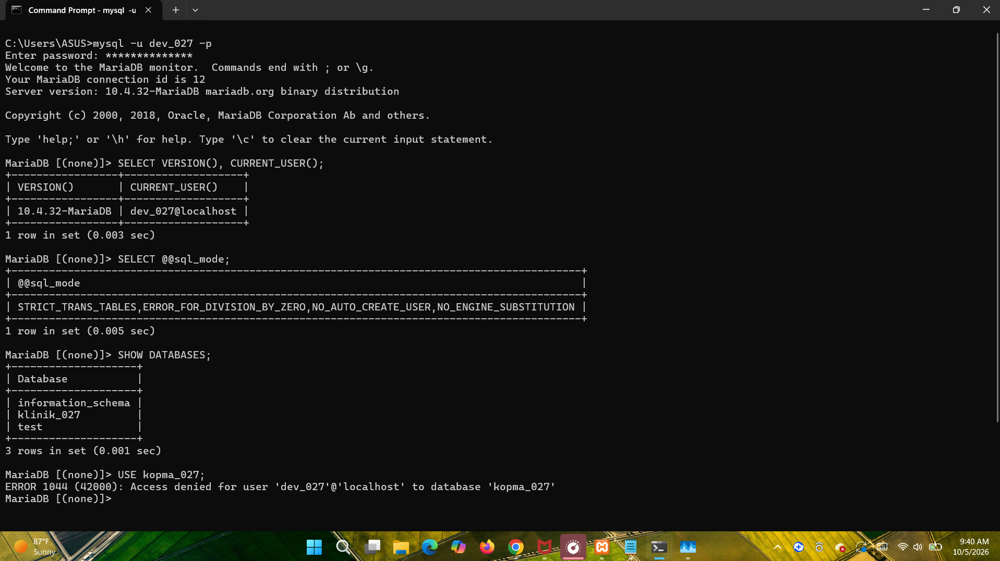

Tangkapan layar ini memperlihatkan daftar basis data yang diizinkan untuk diakses oleh akun `dev_027`, serta memperlihatkan penolakan akses saat mencoba masuk ke basis data `kopma_027`.

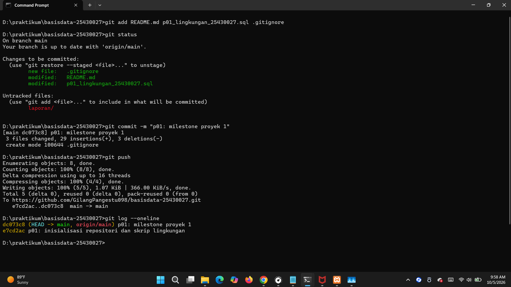

Gambar di atas menunjukkan proses commit dan push perubahan berkas milestone proyek 1 ke repositori remote di GitHub berjalan sukses.

## 7. Pembahasan dan Kendala

Selama pelaksanaan praktikum Modul 1, terdapat beberapa kendala teknis yang dihadapi. Berikut adalah rincian kendala, penyebab, serta langkah penyelesaian yang dilakukan.

**Kendala 1: Mode SQL Server Tidak Ketat (Strict Mode)**

- **Yang terlihat:** Saat melakukan pengecekan dengan kueri `SELECT @@sql_mode;`, hasil yang dikembalikan adalah `NO_ZERO_IN_DATE,NO_ZERO_DATE,NO_ENGINE_SUBSTITUTION`. Mode `STRICT_TRANS_TABLES` tidak aktif.
- **Penyebab:** Pengaturan standar pada berkas konfigurasi MariaDB di instalasi XAMPP ini belum mengaktifkan fitur strict mode untuk validasi data yang lebih disiplin.
- **Cara mengatasi:** Menambah baris konfigurasi `sql_mode=...` (menambahkan `STRICT_TRANS_TABLES`) pada berkas `D:\xampp\mysql\bin\my.ini` di bawah bagian `[mysqld]`. Setelah itu, melakukan restart service MySQL di XAMPP Control Panel. Verifikasi ulang menunjukkan mode SQL sudah menyertakan `STRICT_TRANS_TABLES`.

**Kendala 2: Login Ditolak (ERROR 1045) dan Akun mhs_027 Hilang**

- **Yang terlihat:** Kegagalan autentikasi saat mencoba login sebagai `mhs_027` dan kemudian `root` di CLI, ditandai dengan pesan `ERROR 1045 (28000): Access denied for user '...' (using password: YES)`.
- **Penyebab:** Terdapat dugaan server tidak dimatikan dengan bersih (log menampilkan crash recovery), yang kemungkinan menyebabkan akun `mhs_027` hilang. Dugaan ini belum terbukti. Akun `root` juga ikut gagal login sebelum berhasil dipulihkan.
- **Cara mengatasi:** Langkah pemulihan dilakukan di luar modul dengan menggunakan metode `--init-file` pada saat menjalankan `mysqld`. Melalui skrip inisialisasi tersebut, password `root` berhasil direset. Namun, saat mencoba perintah `ALTER USER` untuk `mhs_027`, muncul ERROR 1396, yang mengonfirmasi bahwa akun tersebut sudah tidak ada lagi di sistem. Langkah terakhir adalah membuat ulang akun `mhs_027` dan memberikan ulang hak akses (`GRANT`). Berkas `reset_init.txt` kemudian dihapus dan Recycle Bin dikosongkan untuk keamanan.

**Kendala 3: Nama Repositori GitHub Berawalan Tanda Minus**

- **Yang terlihat:** Saat membuat repositori di GitHub, halaman web menampilkan nama `-basisdata-25430027`, yang tidak sesuai dengan konvensi penamaan standar praktikum.
- **Penyebab:** Kesalahan pengetikan (typo) secara tidak sengaja saat proses pembuatan repositori baru di GitHub.
- **Cara mengatasi:** Sebelum menjalankan perintah `git remote add` di terminal lokal, kesalahan langsung diperbaiki dengan mengganti nama repositori melalui menu Settings di halaman GitHub. Setelah nama repositori diperbaiki, perintah `git remote add origin` dan `git push` dapat dijalankan dengan sukses tanpa kendala.

## 8. Kesimpulan

Praktikum ini telah memberikan saya pemahaman mendasar namun sangat penting mengenai persiapan dan pengelolaan lingkungan kerja MariaDB serta prinsip-prinsip manajemen akses dalam basis data. Saya telah mempelajari betapa pentingnya menggunakan akun pengguna dengan hak akses yang dibatasi secara spesifik (non-root) untuk menjaga keamanan data dari potensi penyalahgunaan atau akses yang tidak diinginkan. Pemahaman yang saya peroleh mengenai perbedaan kode galat autentikasi dan otorisasi, seperti 1044, 1045, dan 1142, sangat membantu saya dalam mengidentifikasi dan menangani masalah akses basis data. Selain itu, integrasi kontrol versi menggunakan Git telah memastikan bahwa seluruh langkah praktikum yang saya lakukan terdokumentasi dengan baik dan dapat direproduksi dengan aman.

## 9. Pernyataan Penggunaan AI

Dalam penyusunan laporan praktikum ini, saya menyatakan bahwa saya menggunakan alat bantu AI, yaitu ChatGPT, Gemini, dan Claude (semuanya mode default). Penggunaannya adalah sebagai berikut:

- Claude: membimbing saya langkah demi langkah dalam mengikuti prosedur teknis Modul 1, menjelaskan arti kode galat SQL, membantu mendiagnosis dan memberikan prosedur pemulihan (reset password `root`) saat terjadi ERROR 1045, menyusun kerangka `README.md` (identitas proyek) dan kerangka laporan, serta memeriksa jawaban Titik Analisis dan isi laporan.
- AI lain (ChatGPT dan/atau Gemini): membantu menuliskan isi laporan untuk Bagian 1 (Tujuan Praktikum), Bagian 2 (Ringkasan Dasar Teori), Bagian 8 (Kesimpulan), seluruh keterangan gambar, dan draf jawaban Titik Analisis. Saya kemudian memeriksa dan mengoreksi bagian yang tidak sesuai dengan pekerjaan saya.

Seluruh perintah SQL (CLI), pengubahan berkas konfigurasi, pengujian di phpMyAdmin, pengerjaan Latihan E dan Tugas Mandiri F, serta perintah Git (add, commit, push) saya ketik dan jalankan sendiri berdasarkan bimbingan tersebut. Tangkapan layar di laporan ini adalah hasil pekerjaan saya sendiri.

## 10. Bukti Git

- Repositori: https://github.com/GilangPangestu098/basisdata-25430027

| Hash Commit | Pesan Commit |
| --- | --- |
| `d2c3781` | docs: tambah laporan, skrip lingkungan, gitignore, dan pembaruan readme |
| `00e0bf2` | Menambahkan file p01_lingkungan_25430027 |
| `819af81` | Delete p01_laporan_25430027.md |
| `8fcc776` | Delete img directory |
| `26e85b4` | Create README.md |
| `e18e771` | Update struktur folder |
| `11575ce` | Update struktur folder dan hapus file tidak terpakai |
| `76cfac6` | Commit pertama saya |
| `dc073c8` | p01: milestone proyek 1 |
| `e7cd2ac` | p01: inisialisasi repositori dan skrip lingkungan |

## Checklist

**Tabel 1.4 Checklist khusus laporan Pertemuan 1**

| Status | Jenis                 | Yang harus ada                                                                                                                                                                           |
| :----: | :-------------------- | :--------------------------------------------------------------------------------------------------------------------------------------------------------------------------------------- |
|   ☑️   | Berkas wajib          | `p01_lingkungan_<NIM>.sql` (dapat dijalankan ulang), `README.md` berisi Identitas Proyek, `.gitignore`                                                                                   |
|   ☑️   | Bukti tangkapan layar | `SELECT VERSION(), CURRENT_USER();` `SELECT @@sql_mode;` `SHOW DATABASES` sebagai `mhs_<3d>` dan `dev_<3d>`; galat 1044 dan 1142; halaman masuk phpMyAdmin mode cookie; git push pertama |
|   ☑️   | Analisis wajib        | Titik Analisis 1-4; perbedaan kode galat 1044, 1045, dan 1142                                                                                                                            |

### Tabel P.13 Checklist umum laporan praktikum

| Status | Butir                    | Yang harus ada                                                                                       |
| :----: | :----------------------- | :--------------------------------------------------------------------------------------------------- |
|   ☑️   | Identitas                | Nama, NIM, kelas, pertemuan ke-N, tanggal pelaksanaan, nama asisten/dosen                            |
|   ☑️   | Tujuan                   | Tujuan praktikum ditulis ulang dengan bahasa sendiri (maksimal 5 baris)                              |
|   ☑️   | Ringkasan teori          | Pemahaman sendiri atas Dasar Teori, maksimal setengah halaman, tanpa menyalin buku                   |
|   ☑️   | Langkah percobaan (D)    | Tangkapan layar hasil langkah kunci sesuai checklist khusus, masing-masing diberi keterangan singkat |
|   ☑️   | Titik Analisis           | Semua Titik Analisis dijawab lengkap dengan alasan, bukan sekadar ya/tidak                           |
|   ☑️   | Latihan (E)              | Skrip/dokumen hasil latihan beserta bukti berjalan                                                   |
|   ☑️   | Tugas Mandiri (F)        | Milestone proyek pertemuan ini: berkas, bukti, dan penjelasan keputusan desain                       |
|   ☑️   | Pembahasan dan kendala   | Galat yang ditemui, cara membacanya, dan cara mengatasinya                                           |
|   ☑️   | Kesimpulan               | Dua sampai empat kalimat dengan bahasa sendiri                                                       |
|   ☑️   | Pernyataan Penggunaan AI | Alat yang dipakai, untuk apa, bagian mana; tulis "tidak menggunakan" bila tidak memakai              |
|   ☑️   | Bukti Git                | Tautan repositori dan kode commit (hash) pertemuan ini dengan pesan pNN: ...                         |
|   ☑️   | Keaslian                 | Setiap tangkapan layar memperlihatkan akun ber-NIM dan jam sistem; nama objek memuat NIM/inisial     |
