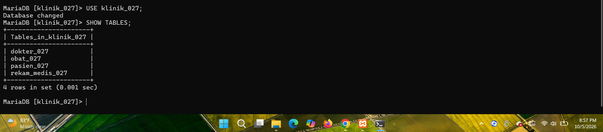
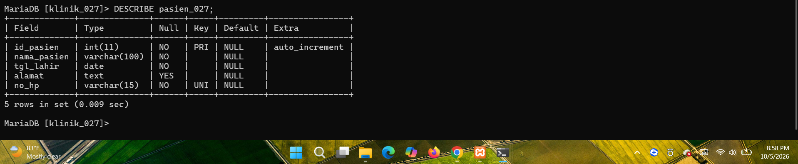
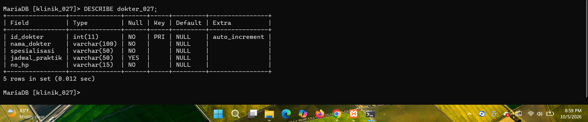
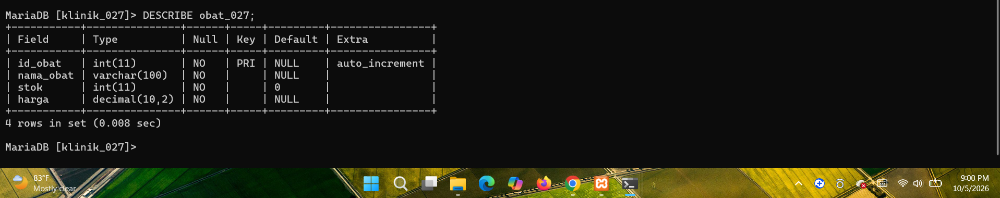
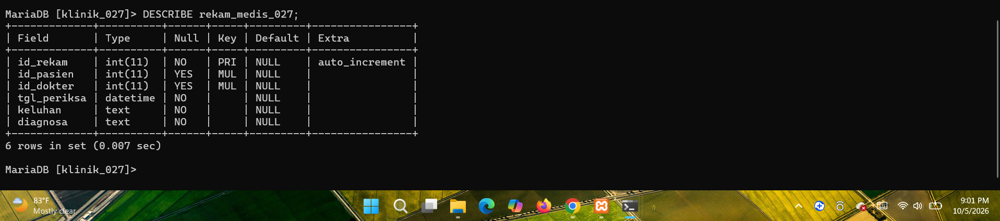

# Laporan Praktikum Basis Data - Modul 2: Data Definition Language (DDL)

* **Nama:** Gilang Pangestu
* **NIM:** 25430027
* **Kelas:** A
* **Program Studi:** Ilmu Komputer
* **Tema Proyek:** Klinik (`klinik_027`)

---

## 1. Tujuan Praktikum
1. Memahami dan mengimplementasikan perintah *Data Definition Language* (DDL) seperti `CREATE`, `ALTER`, dan `DROP` pada MariaDB.
2. Merancang skema relasi basis data yang baik dan terstruktur untuk studi kasus sistem informasi klinik.
3. Menerapkan batasan (*constraints*) integritas data seperti `PRIMARY KEY`, `FOREIGN KEY`, `NOT NULL`, `UNIQUE`, dan `DEFAULT`.
4. Menerapkan aturan referensial *Cascade* (`ON DELETE CASCADE` dan `ON UPDATE CASCADE`).

---

## 2. Perancangan Skema Basis Data `klinik_027`
Basis data ini dirancang dengan 3 tabel induk dan 1 tabel relasi/transaksi:

| No | Nama Tabel | Jenis | Kolom Utama & Atribut | Keterangan / Constraints |
| :--- | :--- | :--- | :--- | :--- |
| 1 | `pasien_027` | Master | `id_pasien`, `nama_pasien`, `tgl_lahir`, `alamat`, `no_hp` | PK (`id_pasien`), `UNIQUE` pada `no_hp` |
| 2 | `dokter_027` | Master | `id_dokter`, `nama_dokter`, `spesialisasi`, `jadwal_praktik`, `no_hp` | PK (`id_dokter`) |
| 3 | `obat_027` | Master | `id_obat`, `nama_obat`, `stok`, `harga` | PK (`id_obat`), `DEFAULT` stok 0 |
| 4 | `rekam_medis_027` | Transaksi | `id_rekam`, `id_pasien`, `id_dokter`, `tgl_periksa`, `keluhan`, `diagnosa` | PK (`id_rekam`), FK ke Pasien & Dokter |

---

## 3. Hasil Eksekusi DDL & Verifikasi

### A. Daftar Tabel (`SHOW TABLES`)

### B. Struktur Tabel Pasien (`DESCRIBE pasien_027`)

### C. Struktur Tabel Dokter (`DESCRIBE dokter_027`)
Tabel dokter telah dimodifikasi menggunakan perintah `ALTER TABLE` untuk menambahkan kolom `jadwal_praktik`.

### D. Struktur Tabel Obat (`DESCRIBE obat_027`)

### E. Struktur Tabel Rekam Medis (`DESCRIBE rekam_medis_027`)

---

## 4. Latihan dan Modifikasi
- **Pembuatan Skrip Aman (`DROP TABLE IF EXISTS`):** Skrip DDL disempurnakan agar mendukung eksekusi berulang tanpa menimbulkan *Error 1050 (Table already exists)* dengan menambahkan perintah penghapusan tabel terbalik dari tabel anak ke tabel induk.
- **Modifikasi Struktur (`ALTER TABLE`):** Menambahkan kolom `jadwal_praktik` bertipe `VARCHAR(50)` pada tabel `dokter_027` untuk mengakomodasi informasi jam kerja dokter.

---

## 5. Titik Analisis (Pertanyaan Evaluasi)
1. **Mengapa pembuatan tabel relasi (`rekam_medis_027`) harus dilakukan setelah tabel induk (`pasien_027` dan `dokter_027`) dibuat?**
   *Jawab:* Karena tabel relasi menggunakan `FOREIGN KEY` yang mereferensikan `PRIMARY KEY` pada tabel induk. Jika tabel induk belum ada, MariaDB akan menolak pembuatan tabel relasi karena kolom referensi belum dikenali.
2. **Apa fungsi dari klausa `ON DELETE CASCADE` pada Foreign Key?**
   *Jawab:* Klausa ini memastikan bahwa jika data induk (misalnya data pasien) dihapus, maka seluruh data rekam medis terkait pasien tersebut di tabel transaksi akan ikut terhapus secara otomatis untuk mencegah inkonsistensi data (yatim piatu / *orphan records*).

---

## 6. Kesimpulan
Modul 2 berhasil diselesaikan dengan baik. Perintah DDL terbukti efektif dalam membangun fondasi struktur tabel basis data klinik yang ternormalisasi, aman, dan menjaga integritas referensial antar entitas. Seluruh skrip kode dan laporan telah diunggah ke repositori GitHub.